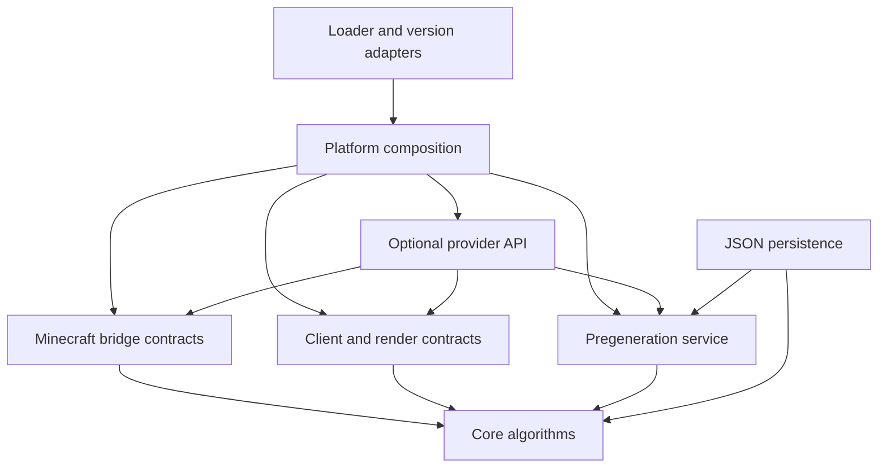
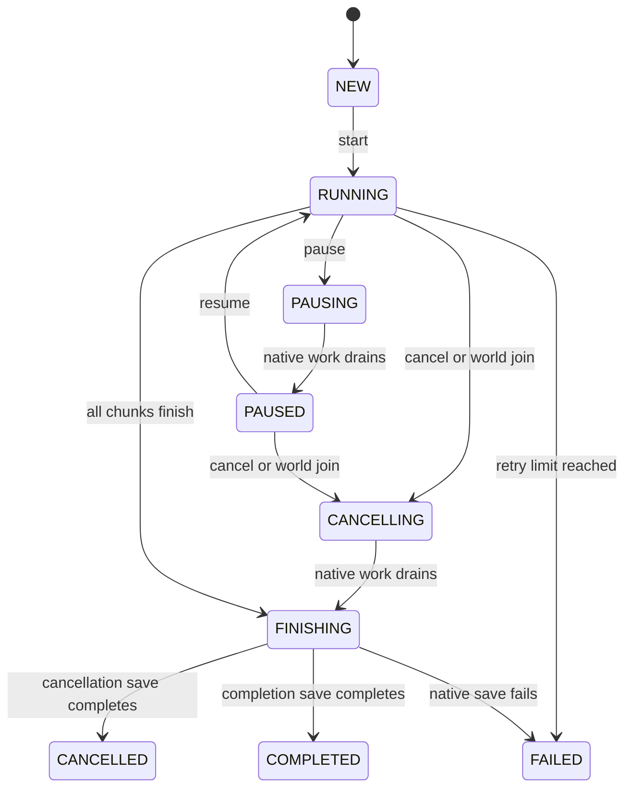

# Map PreView architecture

## Dependency direction

All current modules compile without Minecraft, loader, OpenGL, FancyMenu or Tectonic classes. `minecraft-common` names a boundary, not a dependency on the game. There is no monolithic common class containing a mixture of Yarn names, widgets and scheduling logic.

## Preview lifecycle

1. A version bridge captures vanilla world-creation inputs and bootstraps a detached registry snapshot.
2. The snapshot enumerates actual dimensions and sorted, session-local biome palettes.
3. A provider selector chooses an explicitly supported specialized backend or the active-generator fallback.
4. `TileEngine.beginSession` installs an immutable context and generation epoch, cancelling old jobs.
5. `ViewportPlanner` orders visible coarse tiles, progressively finer visible tiles, then coarse prefetch tiles.
6. Requests enter a bounded executor; workers return immutable primitive data and never invoke graphics APIs.
7. Colorization and filters reuse sampled data. A display revision invalidates old colored uploads without invalidating worldgen data.
8. `RenderUploadQueue` accepts only the active epoch/revision and drains only on its owning render thread.

The renderer must keep useful lower-resolution GPU tiles visible while detailed replacements arrive. Texture lifetime, batching and the GPU cache budget belong to the version renderer; the base does not claim to implement GPU uploads.

## Work and resource bounds

`maximumOutstandingTasks` covers running work, queued work and cancelled work still draining. A semaphore gates every executor admission. The underlying priority queue cannot grow beyond admitted work. Saturation yields `RejectedExecutionException`; callers retry the still-visible requests later instead of blocking the render thread.

Default hardware policy reserves CPU resources for the game. Factory concurrency defaults to one. Increasing it requires proof that the adapter provides independent worker state or safe generator access. Samplers are opened, used and closed on their worker. Close operations release only sampler-private resources.

Cancellation is cooperative, checked before opening a sampler, between raster rows, every 32 samples and before cache publication. Native modded generator calls are not interrupted. Consequently cancellation latency is bounded by the adapter's longest non-cooperative call, not by an unsafe interruption deadline.

Each worker retains at most one sampler. A previous sampler closes on replacement or worker shutdown. A version snapshot therefore needs leases/refcounts, and its registry owner must remain alive until all related samplers have closed. `close()` initiates shutdown; `awaitTermination()` belongs in a lifecycle/background path, never in the rendering loop.

The LRU enforces accounted CPU bytes. Transient worker buffers, queue metadata, snapshot registries and GPU resources have separate budgets. The cache budget is not a claim about total JVM heap occupancy. Configuration caps default CPU cache allocation at one quarter of the current JVM maximum heap.

## Data and cache identity

| Identity input | Why it matters |
| --- | --- |
| Minecraft version and loader ID/version | Different implementations and injected behavior |
| Seed and dimension ID/bounds/sea level | Different world and vertical geometry |
| World preset and generator ID/settings digest | Actual generator configuration |
| Ordered datapack content identities | Pack priority and changed content |
| Worldgen mod versions/content identities | Code affecting generation |
| Worldgen configuration digests, including Tectonic | Changed terrain settings |
| Sorted biome palette fingerprint | Correct interpretation of compact local biome IDs |
| Backend ID/data revision and cache format version | Adapter and algorithm changes |
| Tile coordinates, world span, sample step, channel, Y and query | Exact requested data |

The adapter must provide content digests. A filename, modification timestamp or unordered list of datapacks is insufficient. Block-state palette identity must be part of the generator/settings digest if block channels use session-local state IDs.

Colors and pure display filters are excluded. Biome configuration uses namespaced IDs; integer IDs exist only inside a session. `RasterTile.Builder.freeze()` transfers ownership without a full-array copy and makes further writes fail. Published buffers are read-only.

Heights use `int[]` to preserve arbitrary modded vertical ranges. Height tiles include a one-sample border, allowing gradients and an entire terrain mesh to share adjacent edges. This costs a small border and four bytes per height rather than silently overflowing 16-bit heights.

The GZIP raster codec validates version, full key identity, expected sample count and checksum. Decode allocation is derived from validated expected geometry. An on-disk cache manager and its eviction policy remain an adapter/application concern; the base ships a codec, not an unbounded persistent cache.

## Layer semantics

| Channel | Contract |
| --- | --- |
| Biomes and cave biomes | Actual biome sampler at the requested block Y; bridge converts to native sampling coordinates |
| Height | Raw worldgen height mode; not a promise about decorated surface blocks |
| Surface | Adapter-provided surface classification/state palette |
| Cave density | Float density encoded as integer bits; estimated geometry |
| Cave blocks | Explicit accurate block operation; may require minimal generation |
| Slime chunks | Version-specific chunk rule sampled on the requested grid |
| Structure candidates | Placement candidates, individually marked estimated or verified |
| Verified structures | Only successfully verified structure starts; candidates are rejected |

Missing capabilities carry an explanation. They do not return empty arrays masquerading as valid results. Queries that truncate structure results expose `truncated=true`. A normal biome request never calls height, column or structure operations.

## Pregeneration ownership

`PregenController.tick()` is a server-thread actor. Native completion callbacks only enqueue messages; they never mutate controller state or submit new worldgen. Concurrency is an in-flight chunk limit, not a private pool that competes with C2ME or the native scheduler. Native tickets remain owned until their future completes and are released on the server thread.

Area plans keep row spans/cursors, not millions of positions. Rectangle bounds are inclusive. Circles use chunk centers and a radius measured in chunks. Polygon integer vertices describe chunk-grid edges, using a half-open even-odd center-inclusion rule. Spiral changes traversal order while preserving the same area.

Pause stops new admission and drains native work. Cancel also preserves incomplete dispatched coordinates for a later checkpoint. Successful completion waits for the native save barrier. Checkpoints include the world/configuration identity, dimension, shape/traversal identity, cursor offset and pending retry positions. An incompatible checkpoint is rejected.

The GUI may close while this service continues. Joining the world calls `onWorldJoin()`. The native launch adapter must also expose the requested prompt to resume an unfinished pregeneration job or enter normally. That prompt is not implemented in the base.

## Choices where the source documents differ

- The platform document permits Architectury or separate platform modules. The longer research report recommends Cloche with small interfaces. This base uses the interfaces and ordinary Java library projects; Cloche will assemble actual Minecraft/loader targets when they are added. No competing abstraction stacks are installed.
- Generic active-registry sampling takes precedence over per-biome-mod special cases. Versioned adapters are reserved for nonstandard contracts and verified fast paths.
- Preview sampling is separate from full server chunk generation. Rough 3D starts with height meshes. Accurate blocks, native 3D and experimental GPU worldgen remain explicit capabilities.
- Minecraft X/Z coordinates are an integer tile pyramid, not geographic Web Mercator. Negative coordinates use floor division. An OpenMapTiles-compatible export would need a separately defined coordinate transform and must not be asserted from similar tile numbering.
- GPU vendor names and the mere presence of Nvidium do not prove compute capability or rendering compatibility. Detection and a tested backend determine availability.
